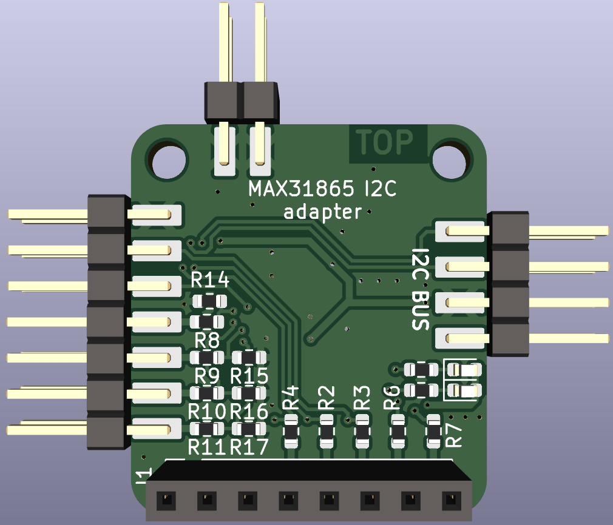
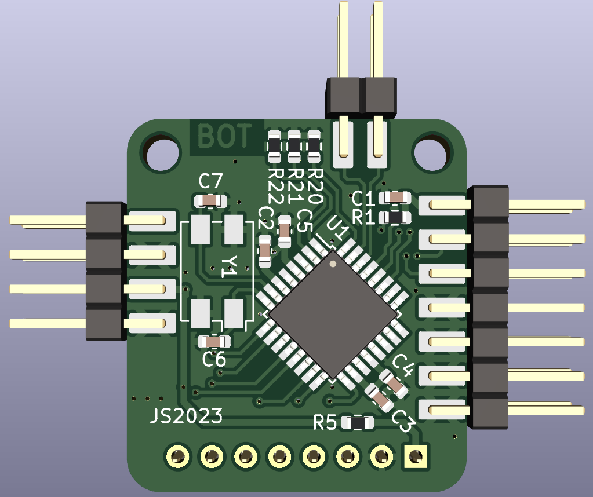

# MAX31865_I2C
SPI to I2C bridge fo iInterfacing the MAX31865 via I2C

# Board / Hardware
The hardware has the same size as the Adafriut MAX31865 module. Also the SPI
connection is at the same position. This allows mounting the module on the back
of the MAX31865 module.

 
